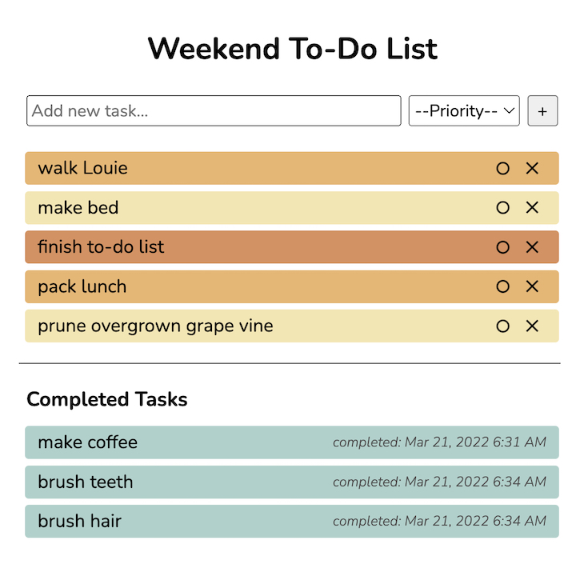

# SQL To-Do List

## Description

This project is a web application to-do list. The user creates tasks that populate a to-do list and has the option to remove or complete the listed tasks.

## Screen Shot

##  Prerequisites and Installation

Project runs in web browser and requires use of a database to store task data.

## Usage

Tasks are entered individually and assigned a priority by the user. The application displays the asks according to the order entered and color codes them according to priority. The user may remove or complete the tasks. If the user chooses to delete a task, an alert prompts them to confirm the choice. Once completed, tasks are displayed in a separate field with the time completed.

## Built With

- javascript
- jQuery.js
- node.js
- PostgresSQL
## Acknowledgements

Thank you to Prime Digital Academy for support and guidance.
## Support

Please contact adair.jenkins@gmail.com with issues or suggestions.

heroku: protected-sands-26986

